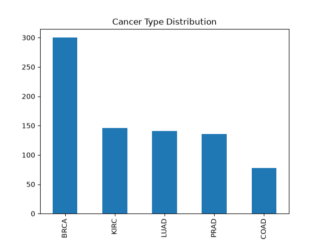
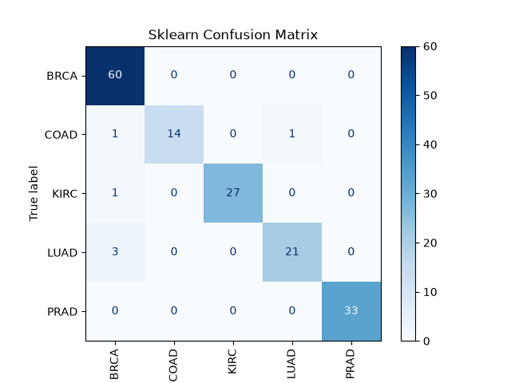
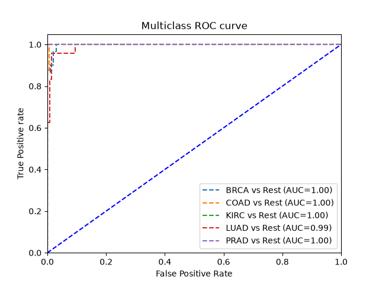

# Machine Learning for Cancer Prediction

This project uses RNA-seq gene expression data to predict different types of cancer using Machine Learning techniques.

## Goal
The main goal of this project is to develop a machine learning model capable of accurately classifying different types of cancer based on patient gene expression data. By analyzing the transcriptomic profiles, we aim to build a robust diagnostic pipeline to differentiate between various cancer classes.

## Requirements
To run this project, you need Python installed. All required libraries are listed in the `requirements.txt` file.

You can install these dependencies using `pip`:
```bash
pip install -r requirements.txt
```

## Questions to Answer
During this project, we aim to answer the following questions:
- What are the most informative genes (features) for distinguishing between different cancer types?
- Can a Random Forest model accurately classify multi-class cancer data?
- Which cancer types are the easiest to predict, and which ones are frequently confused by the model?

## Machine Learning Project Pipeline
The project follows a standard machine learning pipeline, divided into several modular scripts:
1. **Data Loading & Exploration (`data_exploration.py`)**: Loads the dataset, checks for missing values, and visualizes the class distribution of cancer types.
2. **Data Preprocessing (`data_preprocessing.py`)**: Encodes the categorical target labels, splits the dataset into training (80%) and testing (20%) sets, and normalizes the gene expression values using `MinMaxScaler`.
3. **Feature Selection (`feature_selection.py`)**: Computes the mutual information score for each feature and selects the top 300 most relevant genes to reduce dimensionality and improve model performance.
4. **Model Training (`model_training.py`)**: Trains a `RandomForestClassifier` wrapped in a `OneVsRestClassifier` to handle the multiclass classification problem. 
5. **Model Evaluation (`model_evaluation.py`)**: Evaluates the model on the test set, computing metrics like accuracy, precision, recall, and F1-score, alongside visual performance charts.


## Results
*Note: The model correctly classified all cases for BRCA, KIRC, and PRAD classes. The only misclassifications were confusing one COAD case for LUAD, and two LUAD cases for BRCA.*


### Metrics
Here are the evaluation metrics of the model on the test dataset:
- **Accuracy:** 97.08%
- **Precision:** 98.15%
- **Recall:** 98.14%
- **F1-Score:** 98.12%

### Plots to Insert
1. **Cancer Type Distribution**
   
   

2. **Confusion Matrix**
   
   

3. **Multiclass ROC Curve**
 
   


